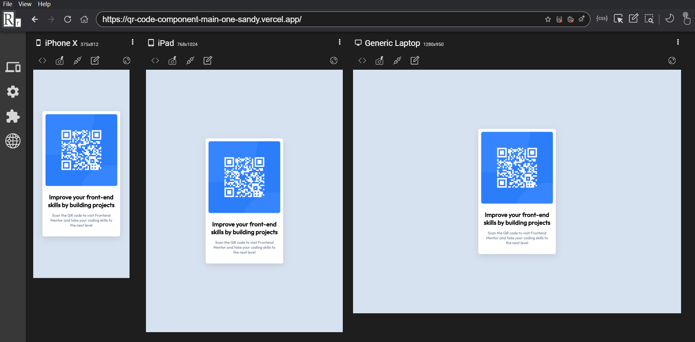

# Frontend Mentor - QR code component solution

This is a solution to the [QR code component challenge on Frontend Mentor](https://www.frontendmentor.io/challenges/qr-code-component-iux_sIO_H). Frontend Mentor challenges help you improve your coding skills by building realistic projects. 

## Table of contents

- [Overview](#overview)
  - [Screenshot](#screenshot)
  - [Links](#links)
- [My process](#my-process)
  - [Built with](#built-with)
- [Author](#author)

## Overview

### Screenshot

### Links

- Solution URL: [Github](https://github.com/CristinaOsorio/qr-code-component-main)
- Live Site URL: [Vercel](https://qr-code-component-main-one-sandy.vercel.app)

## My process

### Built with

- CSS custom properties
- HTML

## Author

- Frontend Mentor - [@CristinaOsorio](https://www.frontendmentor.io/profile/CristinaOsorio)
- LinkedIn - [Cristina Osorio](https://www.linkedin.com/in/maria-cristina-osorio-perez-b205a5187)

